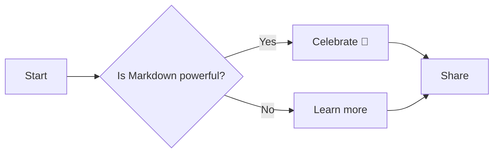

# Temp: Markdown Feature Showcase

Welcome! This temporary post demonstrates a broad set of Markdown features you can use in this site — from basic formatting to LaTeX math, admonitions, diagrams, code blocks, footnotes, and more. It's intentionally verbose so you can test renderers, plugins, and styling.

> Quick note: run the dev server with `npm run dev` to preview this post locally.

---

## Table of Contents

- Headings and inline styles
- Lists and task lists
- Code blocks and syntax highlighting
- Tables
- Admonitions / Callouts
- LaTeX math (KaTeX/MathJax)
- Diagrams (Mermaid)
- Footnotes, details, and extras

---

## Headings and inline styles

You can emphasize text using *italic*, **bold**, and ~~strikethrough~~. Inline code looks like `inlineCode()` and is useful for short snippets.

Emojis: 🎉 🚀 ❤️

## Lists

Unordered list:

- Apples
- Oranges
	- Valencia
	- Navel
- Bananas

Ordered list:

1. Install dependencies
2. Run tests
3. Ship it

Nested lists and mixed types work fine too.

### Task List

- [x] Write demo
- [ ] Add screenshots
- [ ] Publish

---

## Content Tab example
Below is an interactive example showing how to use the site's content-tabs plugin.

::::tabs
:::tab[Preview]
This is the rendered "Preview" tab.

You can include all kinds of content inside a tab — text, lists, code blocks, math, and diagrams.

- Example bullet
- Another item

Inline math: $e^{i\pi} + 1 = 0$

```javascript
// Example code inside a tab
console.log('Hello from a tab!');
```
:::

:::tab[Markup]
The markup used to create this tab group (copy/paste into a `.md` file):

		::::tabs
		:::tab[Preview]
		This is the rendered "Preview" tab.
		:::

		:::tab[Markup]
		The markup used to create this tab group (copy/paste into a `.md` file):
		:::

		:::tab[Code]
		```js
		console.log('Example');
		```
		:::

		:::: 

:::

:::tab[Code]
```javascript
// A code-only tab
export function add(a, b) {
	return a + b;
}
```
:::
::::
## Code Blocks

JavaScript example:

```javascript
// Simple greeting
function greet(name) {
	return `Hello, ${name}!`;
}

console.log(greet('World'));
```

Python example:

```python
def fib(n):
		a, b = 0, 1
		for _ in range(n):
				a, b = b, a + b
		return a

print(fib(10))
```

Bash example:

```bash
# start dev server
npm run dev
```

---

## Tables

| Feature | Syntax example | Notes |
| --- | --- | --- |
| Bold | **bold** | Emphasize text |
| Italic | *italic* | Use sparingly |
| Inline code | `x = 1` | Useful for commands |
| Code block | ```js ... ``` | Syntax highlighting |

Tables support multiple rows and columns — test column widths and wrapping.

---

## Admonitions / Callouts

If your site uses remark-admonitions (or similar), the following syntax should render styled callouts.

:::note
**Note:** This is a triple-colon admonition ("note"). It's handy for short tips or aside content.

- Works with lists and other blocks
- Can include code, links, or markdown
:::

:::tip
**Tip:** Use small, actionable tips rather than long tutorials inside callouts.
:::

> [!WARNING]
> This is a GitHub-style callout (used by some renderers). If unsupported, it will render as a blockquote.

<aside class="notice">
**HTML fallback:** Use raw HTML if the Markdown renderer doesn't support your preferred callout syntax.
</aside>

---

## LaTeX Math (KaTeX / MathJax)

Inline math: Euler's identity is $e^{i\\pi} + 1 = 0$.

Display math:

$$
\\int_{0}^{\\infty} e^{-x}\\,dx = 1
$$

Famous series:

$$
\\sum_{n=1}^{\\infty} \\frac{1}{n^2} = \\frac{\\pi^2}{6}
$$

Matrices and aligned equations:

$$
\textbf{something} = \frac{a}{b}
$$

If KaTeX/MathJax is configured, these will render beautifully.

---

## Diagrams (Mermaid)

You can include Mermaid diagrams inside fenced code blocks. Many static site toolchains support this via remark-mermaid or similar plugins.



---

## Footnotes and extras

Here's a sentence with a footnote.[^1]

<details>
<summary>Click to expand: small example</summary>

```js
console.log('This is inside a collapsible details block');
```

</details>

[^1]: This is the footnote content. Footnotes are great for citations or small asides.

---

## Final Thoughts

This document is meant to be a playground for Markdown features. If anything here doesn't render as expected, check your Markdown/MDX plugins (admonitions, KaTeX/MathJax, Mermaid, footnotes). Want me to convert this to an MDX post, add frontmatter for a specific collection, or wire up a cover image? Tell me which one and I'll update it.

---

Happy testing — and enjoy the markup! 🚀

